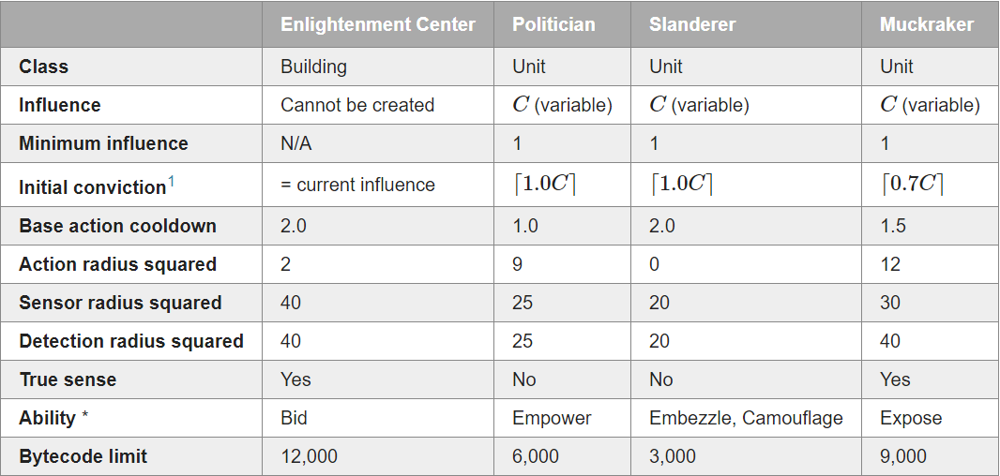

# BattleCode 2021: Campaign
This is the [Battlecode 2021](https://battlecode.org) main website
The [Specifications](http://2021.battlecode.org/specs/specs.md.html) are here
The [Java Documentation](http://2021.battlecode.org/javadoc/index.html) is here

# Overview
Battlecode is a real-time strategy game, for which you will write an AI player. Your AI player will need to strategically manage a robot army and control how your robots work together to defeat the enemy team. As a contestant, you will learn to use artificial intelligence, pathfinding, distributed algorithms, and communications to make your player as competitive as possible.

Teams are given the Battlecode software and a specification of the game rules in early January. Throughout the month, you will refine your player, and compete in scrimmages and tournaments against other teams. During these tournaments, the autonomous players are pitted against each other in a dramatic head-to-head fashion. At the end of the month, the Final Tournament is played out in front of a live audience at MIT, with the top teams receiving cash prizes. The total prize pool is over $15,000.

## Units

**Units** are robots which can move; these will be your team's primary means of combat. Different types of units have different special abilities, and success in the election will depend on how your team uses these abilities to your advantage.

You are able to create units by transferring part of your influence to the new unit. The influence you spend is an integer parameter C, which you may choose for each new unit you create.

The **conviction** of a unit describes how loyal it is to your party; by transferring more influence, you will obtain units that have greater conviction and are therefore more loyal.

**Buildings** are immobile robots; the only type of available building is Enlightenment Centers.

**Conclusion:** ***Conviction*** is a robot's health (if it falls below 0 then your robot is died or converted to the other team), and ***Influence*** is the main currency. You can choose the amount of influence spent on a robot, *higher influence = high conviction*.

Politician            | Slanderer | Muckraker
:-------------------------:|:-------------------------:|:-------------------------:
  |   |  

**Politician**: Units that can transfer conviction to other units with cost of life and 10 conviction. His remaining conviction will divide into equal pieces and then transer to nearby units (if it's more than 10, otherwise, it will be a waste). Enemy units will lose conviction while our units gaining conviction.

- **Conclusion**:  Aggressive action: Go and occupy other centers, give them as much conviction as we can and don't worried about their loyalty - enemies have to cost same amount of conviction to kill them. Defensive action(not recommended): Stay around the Enlightenment center in order to make sure the center won't be occupied, transfering conviction between two centers.

**Slanderer**: Units that can only move. Will bring extra influence after 50 rounds according to his influence and turn into politician after 300 rounds.

- **Conclusion**: Slanderers should hide and wait rather than move towards enemy's politicians and muckrakers.

**Muckraker**: Units that can kill an enemy's slanderer by 10 conviction and increase effect of our politicians' speeches in 50 rounds. The more influence the killed slanderer has, the more effect will increase.

- **Conclusion**: Muckerakers should get enemy's hided slanderers and kill them. Be careful on the conviction - mackraker will die if it falls below 0!

**Enlightenment Centers**: Buildings that can bid for votes and create units. Initial enlightenment centers have 150 influence and others have a random amount of influence between 50 and 500. Each center will gain celi(0.2\*sqrt(t)) each round, while celi means round up and t represents round number.

- **Conclusion**: Occupying as much centers as we can!! Enlightenment center is the only way we can gain influence from!
